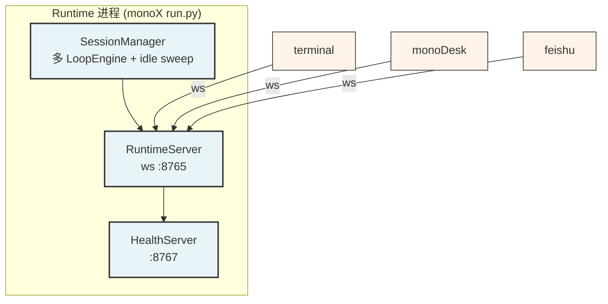

# MonoX

极简 Agent Runtime Core。通过 IM / 桌面 / 终端与 Agent 对话，运行在本地。

## 设计哲学

- **Runtime 极简**：只管 LoopEngine + SessionManager + memory + tools
- **多 channel 共享 session**：多个客户端（terminal / monoDesk / feishu）可以同时连接同一个 session，最后活跃的那个收到回复
- **Channel 独立**：每个 channel 是独立进程，独立升级
- **配置驱动**：`config.toml` 管所有连接参数

## 架构



详细设计见 `spec/ARCHITECTURE.md`。

## 快速启动

```bash
# 1. 准备
./scripts/install.sh

# 2. 配置
export MINIMAX_API_KEY=eyJ...
# 编辑 config.toml：api_base / api_key / model

# 3. 启动 Runtime
uv run python run.py

# 4. 连接 channel（任意多个，并发共享 default session）
uv run python -m extensions.channels.terminal   # 终端 TUI
npm run tauri dev                             # monoDesk 桌面 UI

# 5. 查状态
curl http://127.0.0.1:8767/health
```

## Channel 列表

| Channel | 启动方式 | 说明 |
|---|---|---|
| terminal | `uv run python -m extensions.channels.terminal` | stdio TUI |
| monodesk | `npm run tauri dev`（MonoDesk repo） | 桌面 app |
| feishu | `uv run python -m extensions.channels.feishu` | 飞书 lark-oapi |
| textual | `uv run python -m extensions.channels.textual_chat` | textual 全屏 TUI |

## 目录结构

```
core/           # Runtime 核心（SessionManager / LoopEngine / memory / tools）
extensions/     # 能力扩展（channels / skills）
run.py         # 唯一启动入口
config.toml    # 运行时配置
spec/          # 设计文档
```

## 测试

```bash
uv run pytest tests/ -q
```
