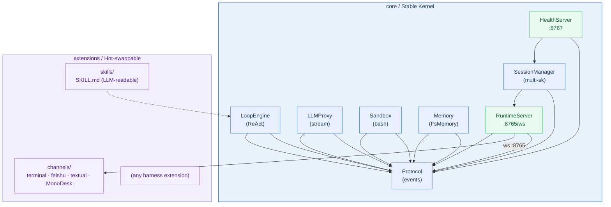

<div align="center">


**English** · [中文](README_zh.md)

[](LICENSE)
[](https://www.python.org)
[](https://github.com/halcyonway/MonoX)

</div>

# MonoX

**A minimal, self-hosted Agent Runtime.** Modular by design — swap any component without touching the rest.

MonoX runs as a long-lived Python process speaking WebSocket. Channels, skills, and other harness extensions live in `extensions/` — completely decoupled from the core.

## Features

- **Protocol-first architecture** — Cross-module boundaries use `Protocol` + frozen dataclasses. Swap an implementation without changing anything else.
- **Multi-channel, multi-session** — One runtime, many channels. Sessions are isolated; share state via `last_active_source` fan-out.
- **Tool-augmented ReAct loop** — Extensible tool registry. Bash execution, memory, skills — all through the same protocol.
- **Hot-swappable extensions** — Anything in `extensions/` can be rewritten independently. Core stays untouched.
- **Long-term memory** — File-based storage with embedding-based retrieval.

## Architecture



## Quick Start

```bash
# 1. Install dependencies
./scripts/install.sh

# 2. Configure
cp config.example.toml config.toml
# Edit config.toml: set api_base, api_key, model

# 3. Start the runtime
uv run python run.py          # ws server :8765, health :8767

# 4. Connect a channel
uv run python -m extensions.channels.terminal    # built-in terminal TUI

# Check health
curl http://127.0.0.1:8767/health
```

## Configuration

All settings in `config.toml`. Sensitive values use environment variable substitution:

| Variable | Description |
|---|---|
| `MINIMAX_API_KEY` | MiniMax API key |
| `ZHIPU_API_KEY` | Zhipu GLM API key |
| `FEISHU_APP_ID` | Feishu/Lark app ID |
| `FEISHU_APP_SECRET` | Feishu/Lark app secret |

## Project Layout

```
core/                    # Minimal runtime kernel — zero UI, zero extension SDK
├── protocol/            #   Event schemas (frozen dataclasses)
├── loop/                #   ReAct engine + tool registry
├── llm_proxy/           #   OpenAI-compatible streaming
├── sandbox/             #   Bash execution
├── memory/              #   Long-term memory (FsMemoryStore)
├── runtime_server.py    #   WebSocket server (:8765)
├── session_manager.py   #   Multi-session management
└── config.py            #   TOML config loader
extensions/              # Hot-swappable extensions
├── channels/            #   terminal / feishu / textual / MonoDesk
├── skills/              #   Skill definitions (LLM-readable)
└── ...                  #   Any harness extension can live here
run.py                   # Assembly entry point
config.toml              # Runtime configuration
```

## Channels

| Channel | Description |
|---|---|
| `terminal` | Stdio-based TUI |
| `feishu` | Feishu/Lark bot |
| `textual` | Textual full-screen TUI |
| `MonoDesk` | [Desktop UI](https://github.com/halcyonway/MonoDesk) |

## License

MIT
