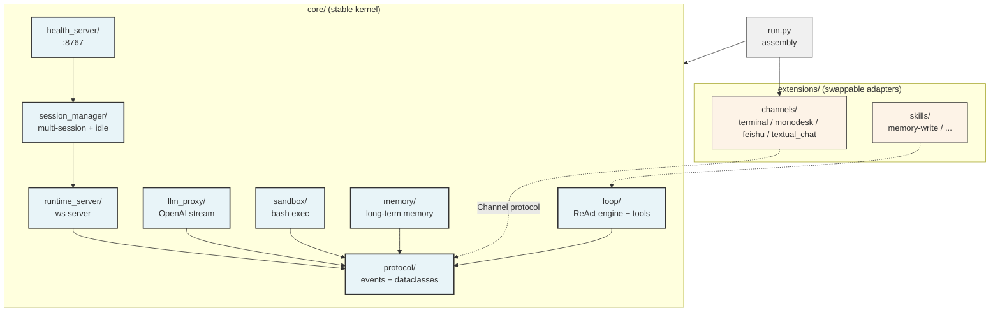

# MonoX

A minimal, self-use Agent Runtime. Code it, scratch it, keep it lean.

**系统 = 模块 + 协议。** Runtime 进程跑核心（协议 + ReAct 引擎 + 存储/执行抽象），channel 作为 feature 通过协议接入。

[MonoDesk](https://github.com/halcyonway/MonoDesk) 是桌面 UI channel 实现（独立仓库）。

## Design philosophy

- **Stable core, swappable adapters** — `core/` is the zero-UI / zero-IM / zero-LLM-SDK kernel. `extensions/` holds adapters that can be rewritten freely. `run.py` is the assembly layer.
- **Protocol-first, duck-typed** — Cross-module boundaries use `Protocol` + frozen dataclasses. If it quacks like the protocol, it IS the protocol. Swapping an implementation touches nothing else.
- **Runtime knows nothing about channels** — `RuntimeServer` only sees ws frames. Channel type / protocol is opaque to it.
- **Multi-session in one process** — Multiple channels share the main session via `last_active_source` fan-out, or use independent `session_key`s.
- **Config-driven** — `config.toml` owns all connection params. `run.py` reads only LLM / server / sandbox sections.

Full design: `spec/ARCHITECTURE.md` (§2 overview / §6 core modules / §9 extensions / §12 multi-session).

## 架构



## Quick start

```bash
# 1. Prepare
./scripts/install.sh

# 2. Configure
export MINIMAX_API_KEY=eyJ...
# Edit config.toml: api_base / api_key / model

# 3. Start Runtime
uv run python run.py

# 4. Connect a channel (independent process, multiple concurrent)
uv run python -m extensions.channels.terminal   # terminal TUI
# MonoDesk desktop: https://github.com/halcyonway/MonoDesk

# 5. Check Runtime status
curl http://127.0.0.1:8767/health
```

## Channels

| Channel | Description |
|---|---|
| terminal | stdio TUI |
| monodesk | desktop app (separate repo: [MonoDesk](https://github.com/halcyonway/MonoDesk)) |
| feishu | lark-oapi |
| textual | textual full-screen TUI |

Channels 自带启动方式，详见各自代码。

## Layout

```
core/                 # stable kernel
├── protocol/         #   events + ws frame schema
├── loop/             #   ReAct engine + tool registry
├── llm_proxy/        #   OpenAI-compatible stream
├── sandbox/          #   bash exec
├── memory/           #   long-term memory (FsMemoryStore)
├── runtime_server.py #   ws server (:8765)
├── session_manager.py #  multi-session + idle
├── health_server.py  #   HTTP :8767
└── config.py         #   config.toml loader
extensions/           # adapters (rewritable)
├── channels/         #   terminal / monodesk / feishu / textual_chat
└── skills/           #   SKILL.md (LLM-readable)
run.py                # assembly entry
config.toml           # runtime config
spec/                 # design docs (ARCHITECTURE.md + requirements/)
```

## Test

```bash
uv run pytest tests/ -q
```

## Feature modules

| Feature | Spec |
|---|---|
| 1. 多 channel（独立进程 + 多 session 共享） | [`spec/requirements/multi-session.md`](spec/requirements/multi-session.md) |
| 2. 上下文压缩（L1/L2） | [`spec/requirements/context-compression.md`](spec/requirements/context-compression.md) |
| 3. 长期记忆（Memory.md + notes/） | [`spec/ARCHITECTURE.md` §8](spec/ARCHITECTURE.md#8-关键存储设计) |
| 4. 事件建模（frozen dataclass + XML 包装） | [`spec/requirements/event-wrapper.md`](spec/requirements/event-wrapper.md) |