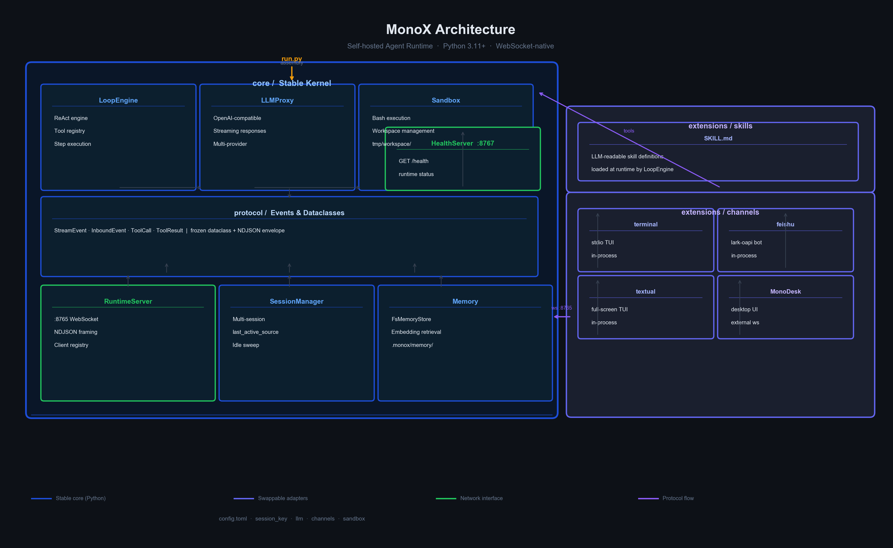

<!-- English -->
# MonoX

**A minimal, self-hosted Agent Runtime.** Modular by design — swap any component without touching the rest.

MonoX runs as a long-lived Python process that speaks WebSocket. Channels (terminal, Feishu, desktop UI, etc.) connect as clients. The core knows nothing about specific channel implementations.

## Features

- **Protocol-first architecture** — Cross-module boundaries use `Protocol` + frozen dataclasses. Swap an implementation without changing anything else.
- **Multi-channel, multi-session** — One runtime, many channels. Sessions are isolated; share state via `last_active_source` fan-out.
- **Tool-augmented ReAct loop** — Extensible tool registry. Bash execution, memory, skills — all through the same protocol.
- **Hot-swappable adapters** — Channels live in `extensions/`. Rewrite any channel without touching the core.
- **Long-term memory** — File-based storage with embedding-based retrieval.

## Architecture



```
┌─────────────────────────────────── Runtime ──────────────────────────────────┐
│  ┌─────────────┐    ┌────────────┐    ┌─────────────┐    ┌───────────────┐  │
│  │ LoopEngine  │───▶│  Protocol  │◀───│  LLMProxy   │    │  Sandbox      │  │
│  │ (ReAct)     │    │  (events)  │    │  (stream)   │    │  (bash exec)  │  │
│  └─────────────┘    └────────────┘    └─────────────┘    └───────────────┘  │
│         │                 ▲                                                    │
│         ▼                 │                 ┌───────────────┐                 │
│  ┌─────────────┐    ┌────────────┐         │  Memory       │                 │
│  │  SessionMgr │◀──▶│RuntimeServer│◀──────▶│  (FsMemory)   │                 │
│  │ (multi-sk)  │    │  :8765/ws  │         └───────────────┘                 │
│  └─────────────┘    └────────────┘                                              │
└───────────────────────────────────────────────────────────────────────────────┘
         ▲
         │ ws :8765
  ┌──────┴──────┐
  │  Channels   │
  │ terminal    │
  │ feishu      │
  │ textual     │
  │ MonoDesk    │
  └─────────────┘
```

## Quick Start

```bash
# 1. Install dependencies
./scripts/install.sh

# 2. Configure — copy the template and fill in your keys
cp config.example.toml config.toml
# Edit config.toml: set api_base, api_key, model

# 3. Start the runtime
uv run python run.py          # starts ws server on :8765, health on :8767

# 4. Connect a channel
uv run python -m extensions.channels.terminal    # built-in terminal TUI

# Check health
curl http://127.0.0.1:8767/health
```

## Configuration

All settings live in `config.toml`. Sensitive values use environment variable substitution:

| Variable | Description |
|---|---|
| `MINIMAX_API_KEY` | MiniMax API key |
| `ZHIPU_API_KEY` | Zhipu GLM API key |
| `FEISHU_APP_ID` | Feishu/Lark app ID |
| `FEISHU_APP_SECRET` | Feishu/Lark app secret |

## Project Layout

```
core/                    # Stable kernel — zero UI, zero channel SDK
├── protocol/            #   Event schemas (frozen dataclasses)
├── loop/                #   ReAct engine + tool registry
├── llm_proxy/           #   OpenAI-compatible streaming
├── sandbox/             #   Bash execution
├── memory/              #   Long-term memory (FsMemoryStore)
├── runtime_server.py    #   WebSocket server (:8765)
├── session_manager.py   #   Multi-session management
└── config.py            #   TOML config loader
extensions/              # Swappable adapters
├── channels/            #   terminal / feishu / textual
└── skills/              #   Skill definitions (LLM-readable)
run.py                   # Assembly entry point
config.toml              # Runtime configuration
```

## Channels

| Channel | Description |
|---|---|
| `terminal` | Stdio-based TUI |
| `feishu` | Feishu/Lark bot |
| `textual` | Textual full-screen TUI |
| `MonoDesk` | [Desktop UI](https://github.com/halcyonway/MonoDesk) |

## License

MIT

---

<!-- 中文 -->
# MonoX

**一个极简的自托管 Agent Runtime。** 模块化设计 — 任意组件均可替换，不影响其他部分。

MonoX 以长期运行的 Python 进程运行，通过 WebSocket 通信。Channel（终端、飞书、桌面 UI 等）作为客户端连接。核心内核对具体 channel 实现一无所知。

## 特性

- **协议优先架构** — 跨模块边界使用 `Protocol` + 不可变 dataclass。替换实现不影响其他模块。
- **多 Channel、多 Session** — 一个 Runtime，多个 Channel。Session 相互隔离，通过 `last_active_source` 共享状态。
- **工具增强的 ReAct 循环** — 可扩展的工具注册表。Bash 执行、记忆、Skills 均通过同一协议。
- **热插拔适配器** — Channel 位于 `extensions/`，重写任意 Channel 不触及核心。
- **长期记忆** — 基于文件的存储，支持 embedding 检索。

## 架构

```
┌─────────────────────────────────── Runtime ──────────────────────────────────┐
│  ┌─────────────┐    ┌────────────┐    ┌─────────────┐    ┌───────────────┐  │
│  │ LoopEngine  │───▶│  Protocol  │◀───│  LLMProxy   │    │  Sandbox      │  │
│  │ (ReAct)     │    │  (events)  │    │  (stream)   │    │  (bash exec)  │  │
│  └─────────────┘    └────────────┘    └─────────────┘    └───────────────┘  │
│         │                 ▲                                                    │
│         ▼                 │                 ┌───────────────┐                 │
│  ┌─────────────┐    ┌────────────┐         │  Memory       │                 │
│  │  SessionMgr │◀──▶│RuntimeServer│◀──────▶│  (FsMemory)   │                 │
│  │ (multi-sk)  │    │  :8765/ws  │         └───────────────┘                 │
│  └─────────────┘    └────────────┘                                              │
└───────────────────────────────────────────────────────────────────────────────┘
         ▲
         │ ws :8765
  ┌──────┴──────┐
  │  Channels   │
  │ terminal    │
  │ feishu      │
  │ textual     │
  │ MonoDesk    │
  └─────────────┘
```

## 快速开始

```bash
# 1. 安装依赖
./scripts/install.sh

# 2. 配置 — 复制模板并填写密钥
cp config.example.toml config.toml
# 编辑 config.toml：设置 api_base、api_key、model

# 3. 启动 Runtime
uv run python run.py          # 启动 ws server :8765，health :8767

# 4. 连接 Channel
uv run python -m extensions.channels.terminal    # 内置终端 TUI

# 检查状态
curl http://127.0.0.1:8767/health
```

## 配置

所有设置在 `config.toml` 中。敏感值使用环境变量：

| 变量 | 说明 |
|---|---|
| `MINIMAX_API_KEY` | MiniMax API 密钥 |
| `ZHIPU_API_KEY` | 智谱 GLM API 密钥 |
| `FEISHU_APP_ID` | 飞书应用 ID |
| `FEISHU_APP_SECRET` | 飞书应用密钥 |

## 项目结构

```
core/                    # 稳定内核 — 零 UI、零 channel SDK
├── protocol/            #   事件 schema（不可变 dataclass）
├── loop/                #   ReAct 引擎 + 工具注册表
├── llm_proxy/           #   OpenAI 兼容流式
├── sandbox/             #   Bash 执行
├── memory/              #   长期记忆（FsMemoryStore）
├── runtime_server.py    #   WebSocket 服务端（:8765）
├── session_manager.py   #   多 session 管理
└── config.py            #   TOML 配置加载器
extensions/              # 可插拔适配器
├── channels/            #   terminal / feishu / textual
└── skills/              #   Skill 定义（LLM 可读）
run.py                   # 装配入口
config.toml              # Runtime 配置
```

## Channels

| Channel | 说明 |
|---|---|
| `terminal` | 标准输入输出 TUI |
| `feishu` | 飞书机器人 |
| `textual` | Textual 全屏 TUI |
| `MonoDesk` | [桌面 UI](https://github.com/halcyonway/MonoDesk) |

## License

MIT
