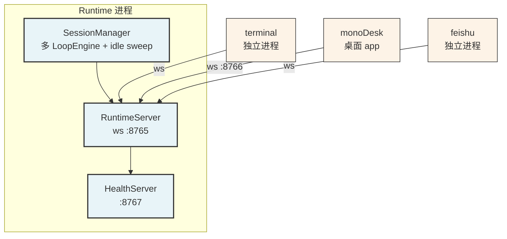

# MonoX

极简 Agent Runtime Core。通过 channel 与 Agent 交互——channel 是独立进程，Runtime 只跑核心逻辑。

## 设计哲学

- **Runtime 极简**：只管 LoopEngine + SessionManager + ws server，不碰 channel
- **Channel 独立**：每个 channel 是独立进程，独立升级，Runtime 通过 WebSocket 连接
- **配置驱动**：所有连接参数（host/port/api_key）在 `config.toml`，Runtime 读取 LLM 配置，channel 读自己那份
- **单进程多 session**：一个 Runtime 支持多个 `session_key`，idle 回收

详见 `spec/ARCHITECTURE.md`（§12 讲 Runtime 架构）和 `spec/requirements/multi-session.md`（多 session 设计）。

## 架构



## 快速启动

```bash
# 1. 准备
./scripts/install.sh

# 2. 配置
export MINIMAX_API_KEY=eyJ...
# 编辑 config.toml：api_base / api_key / model

# 3. 启动 Runtime
uv run python run.py

# 4. 启动 channel（另一个终端）
uv run python -m extensions.channels.terminal   # terminal TUI
npm run tauri dev                             # monoDesk 桌面 UI

# 5. 查状态
curl http://127.0.0.1:8767/health
```

## Channel 列表

| Channel | 启动方式 | 说明 |
|---|---|---|
| terminal | `uv run python -m extensions.channels.terminal` | stdio TUI |
| monodesk | `npm run tauri dev`（MonoDesk repo） | 桌面 app，连 `ws://127.0.0.1:8766` |
| feishu | `uv run python -m extensions.channels.feishu` | 飞书 lark-oapi |
| textual | `uv run python -m extensions.channels.textual_chat` | textual 全屏 TUI |

## 目录结构

```
core/           # Runtime 核心（SessionManager / RuntimeServer / LoopEngine）
extensions/     # 能力扩展（channels / skills）
run.py          # 唯一启动入口
config.toml     # 运行时配置
spec/           # 设计文档（ARCHITECTURE.md + requirements/）
```

## 测试

```bash
uv run pytest tests/ -q
```
