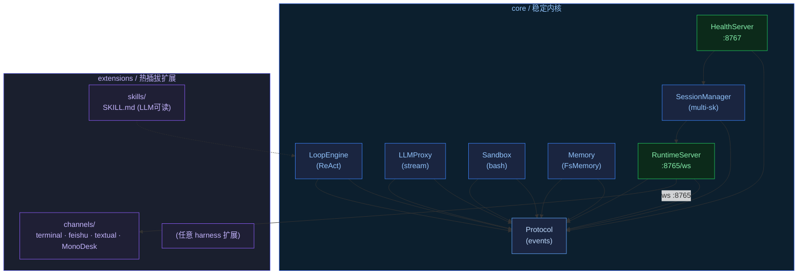

# MonoX

**一个极简的自托管 Agent Runtime。** 模块化设计 — 任意组件均可替换，不影响其他部分。

MonoX 以长期运行的 Python 进程运行，通过 WebSocket 通信。Channel、Skills 以及其他 harness 扩展均位于 `extensions/`，与核心完全解耦。

[](LICENSE)

## 特性

- **协议优先架构** — 跨模块边界使用 `Protocol` + 不可变 dataclass。替换实现不影响其他模块。
- **多 Channel、多 Session** — 一个 Runtime，多个 Channel。Session 相互隔离，通过 `last_active_source` 共享状态。
- **工具增强的 ReAct 循环** — 可扩展的工具注册表。Bash 执行、记忆、Skills 均通过同一协议。
- **热插拔扩展** — `extensions/` 下的任何模块均可独立重写，核心保持不动。
- **长期记忆** — 基于文件的存储，支持 embedding 检索。

## 架构



## 快速开始

```bash
# 1. 安装依赖
./scripts/install.sh

# 2. 配置
cp config.example.toml config.toml
# 编辑 config.toml：设置 api_base、api_key、model

# 3. 启动 Runtime
uv run python run.py          # ws server :8765，health :8767

# 4. 连接 Channel
uv run python -m extensions.channels.terminal    # 内置终端 TUI

# 检查状态
curl http://127.0.0.1:8767/health
```

## 配置

所有设置在 `config.toml` 中。敏感值使用环境变量：

| 变量 | 说明 |
|---|---|
| `MINIMAX_API_KEY` | MiniMax API 密钥 |
| `ZHIPU_API_KEY` | 智谱 GLM API 密钥 |
| `FEISHU_APP_ID` | 飞书应用 ID |
| `FEISHU_APP_SECRET` | 飞书应用密钥 |

## 项目结构

```
core/                    # 最小运行内核 — 零 UI、零扩展 SDK
├── protocol/            #   事件 schema（不可变 dataclass）
├── loop/                #   ReAct 引擎 + 工具注册表
├── llm_proxy/           #   OpenAI 兼容流式
├── sandbox/             #   Bash 执行
├── memory/              #   长期记忆（FsMemoryStore）
├── runtime_server.py    #   WebSocket 服务端（:8765）
├── session_manager.py   #   多 session 管理
└── config.py            #   TOML 配置加载器
extensions/              # 热插拔扩展
├── channels/            #   terminal / feishu / textual / MonoDesk
├── skills/              #   Skill 定义（LLM 可读）
└── ...                  #   任意 harness 扩展均可放在此处
run.py                   # 装配入口
config.toml              # Runtime 配置
```

## Channels

| Channel | 说明 |
|---|---|
| `terminal` | 标准输入输出 TUI |
| `feishu` | 飞书机器人 |
| `textual` | Textual 全屏 TUI |
| `MonoDesk` | [桌面 UI](https://github.com/halcyonway/MonoDesk) |

## License

MIT
